# Песочница для отладки процесса ревью PR

## Что это и какую проблему решает

Этот код автоматизирует процесс ревью PR в data warehouse проекте. Помогает уведомить всех, на кого повлияет изменение функций, и назначить их на ревью. Такой кастомный анализатор воздействия от PR на все зависимые файлы. Настроен на репо `sravni/etl`.

Отслеживает зависимости между SQL-функциями и представлениями, автоматически назначает ревьюеров из разных команд в правильном порядке (code owners → facilitators → tech team). 

Workflow анализирует измененные файлы, проверяет предыдущие апрувы и управляет лейблами PR для обеспечения корректного процесса ревью. Интегрирован с системой автоматического сканирования зависимостей для определения всех заинтересованных команд.

В терминах репо:
* Овнер -- ответственный за функцию
* Фасилитатор -- ответственный за объект, в котором используется функция

На основе этого репо и видео нужно воспроизвести настройку в организации сравни.

**Видео-демонстрация:** https://disk.yandex.ru/i/mHc6IHgE2hOStQ

## Что умеет

* 3-ухровневая система ревью с разными командами
* Автоматическое управление лейблами PR в зависимости от статуса ревью
* Отслеживание актуальных апрувов от каждой команды (хотя бы один от команды)
* Автоматическое назначение следующей команды ревьюеров
* Поддержка связи изменений с ответственными за функции и другие файлы в формате CODEOWNERS
* Сканер зависимостей в файлах гита для определения команд-ревьюеров
* Генерация артефактов с информацией о зависимостях для отладки
* Можно запросить ревью повторно у того же человека

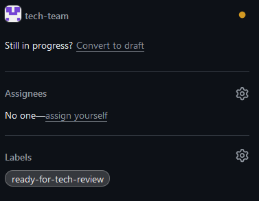

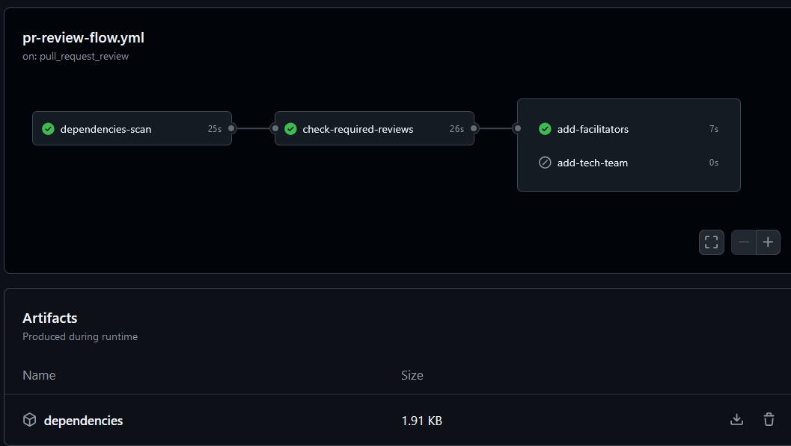

Ниже я опишу, как воспроизвести этот функционал в sravni, какие настройки нужно сделать в организации, репозиториях и как сконфигурировать маппинги функция-витрина/вьюха-овнер

## Уровень организации
Прежде всего, в Организации (org) нужно создать команды (teams).

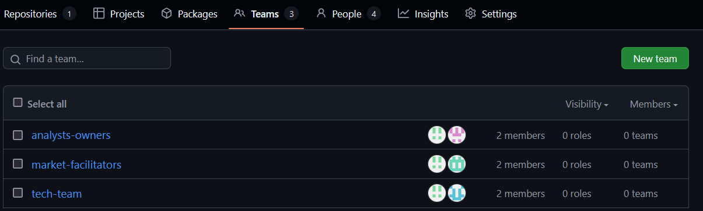

Если команда владеет функцией, она должна содержать "-owners" в названии. Если ответственна за зависимый от функции объект, -facilitators (н. osago-owners, market-facilitators).

В команду нужно добавить все учётные записи людей, которые будут ответственны за review изменений в объекте. Для продвижения на следующий этап достаточно хотя бы одного approve из каждой ответственной команды.

Команде нужно выдать write права на репозиторий, в котором будет запускаться пайплайн с Auto-review. У каждого члена команды будет право на создание и изменение объектов в репозитории.

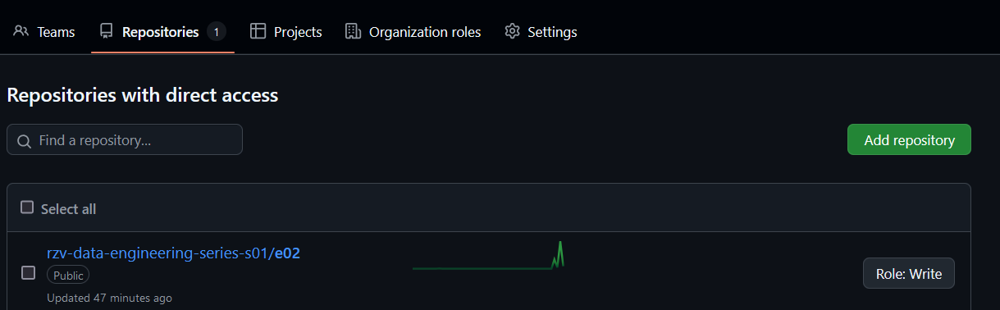

В настройках команды, Scheduled reminders, настраивается связь со Slack-каналом, куда будут приходить все уведомления для этой группы, то есть для каждой команды нужно создать свой Slack канал внутри sravni Workspace'a. Связь команда-канал -- многие ко многим.

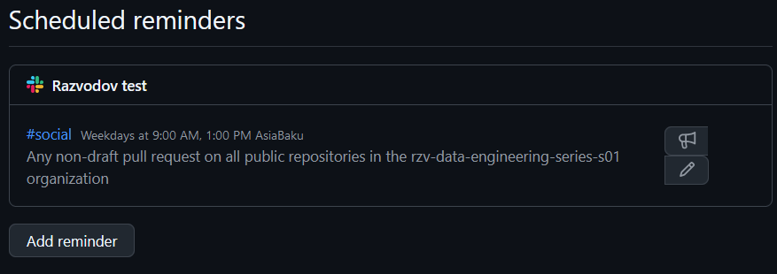

Выбирается время (хоть каждые полчаса), остальные настройки можно оставить по умолчанию или фильтровать "мусор". Также там можно включить назначение ответственным случайного человека из команды, а не всех (в секции Code review). 

Оповещения выглядят так и приходят на всю команду (в канал):

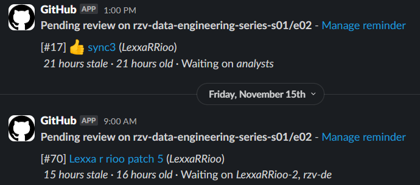

## Уровень репозитория

Добавить workflow и следующие файлы в ветку main (default). Их настройка будет описана позднее:
```
.github
  |-- scripts
      |-- __init__.py
      |-- generate_codefacilitators.py
      |-- scan_dependencies.py
  |-- tests
      |-- __init__.py
      |-- test_scan_dependencies.py
  |-- workflows
      |-- pr-review-flow.yml
  |-- CODEOWNERS
  |-- CODETECHTEAM
  |-- MARTOWNERS
```
Settings - Rules - Rulesets: создать правило с байпасом у команды dwh и требованием хотя бы 3 аппрувов и всех успешных проверок перед разрешением merge, а также блокировку force push прямо в main ветку.

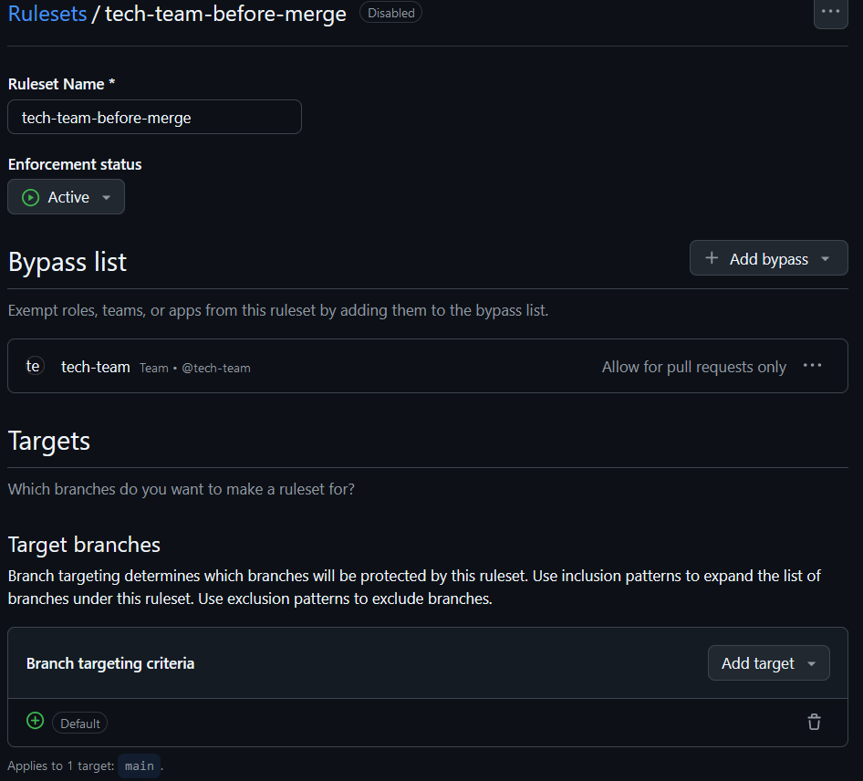

Проверить в Settings - Actions - General, что Policies разрешают запуск внешних для компании actions хотя бы для выбранных репозиториев.

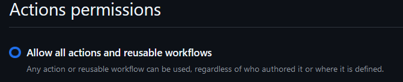

В разработческих настройках одного из пользователей нужно создать Personal access token (classic) с правами (как минимум, при возникновении странных ошибок попробуй докинуть больше прав):
* read:org (для чтения данных о командах)
* repo (для вытаскивания мета-данных из ревью PR)

В Settings - Secrets and variables - Actions нужно создать кастомный секрет PR_REVIEW_TOKEN, вставить токен выше. Также сохрани его в secret vault.

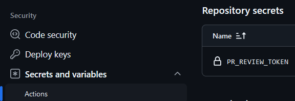


## Настройка связи sql файлов с командами

* **MARTOWNERS** -- по маске указывается связь между файлами вьюх (и других объектов) и ответственными командами
* **CODEOWNERS** -- по маске указывается связь между файлами функций и ответственными командами
* **CODETECHTEAM** -- указывается название dwh или другой тех. команды, для унификации подхода
* **CODEFACILITATORS** -- заполняется вручную скриптом и выгружается в Artifacts, где строится маппинг между файлами функций и командами из MARTOWNERS

Используется формат GLOB-маски, например путь `deployer/patch/DWH/kimball/*url_to_product.sql @rzv-data-engineering-series-s01/analysts-owners` будет назначать указанную команду `analysts-owners` в организации `@rzv-data-engineering-series-s01` (будет sravni) для файлов:
```

deployer/patch/DWH/kimball/r_3*f_utm_campaign_to_product.sql @rzv-data-engineering-series-s01/analysts-owners
deployer/patch/DWH/kimball/r_3*f_utm_to_financial_channel.sql @rzv-data-engineering-series-s01/analysts-owners
```

По формату похоже на gitignore, можно назначать несколько команд в одну строку через пробел. Подробнее здесь: https://docs.github.com/en/repositories/managing-your-repositorys-settings-and-features/customizing-your-repository/about-code-owners#codeowners-syntax 

## Обрати внимание
**Запрос повторного ревью не снимает право merge, если уже есть 3 ревью**

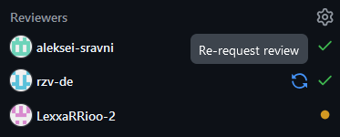

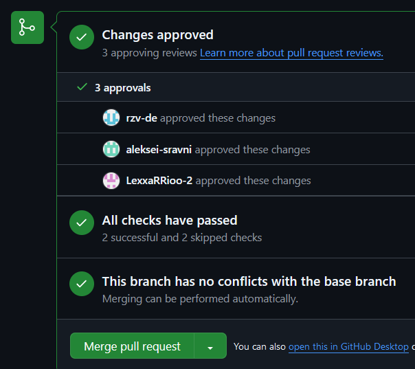

Хотя работает через dismiss

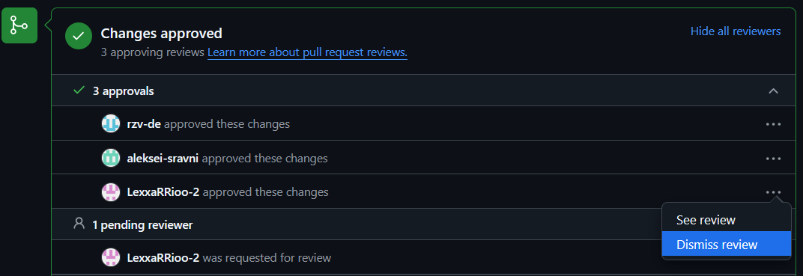

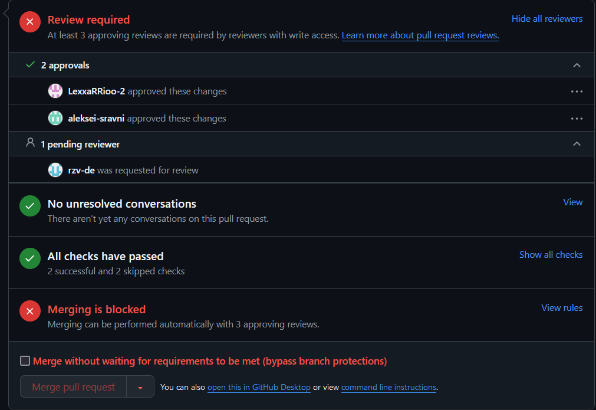

**Метки не возвращаются при откате ревью**

**Есть зависимость от форкнутого репо, перенеси к себе экшн и/или влей в исходный репо**
https://github.com/LexxaRRioo/codefacilitators/tree/debugging-locally-in-github-actions

## Галерея

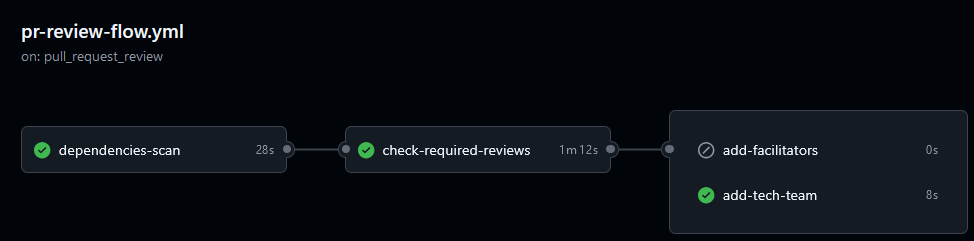

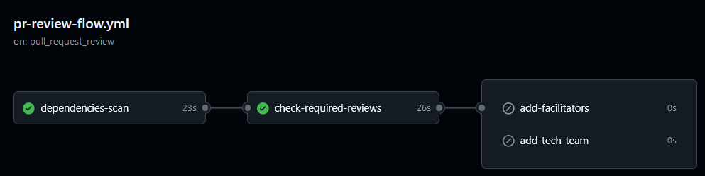

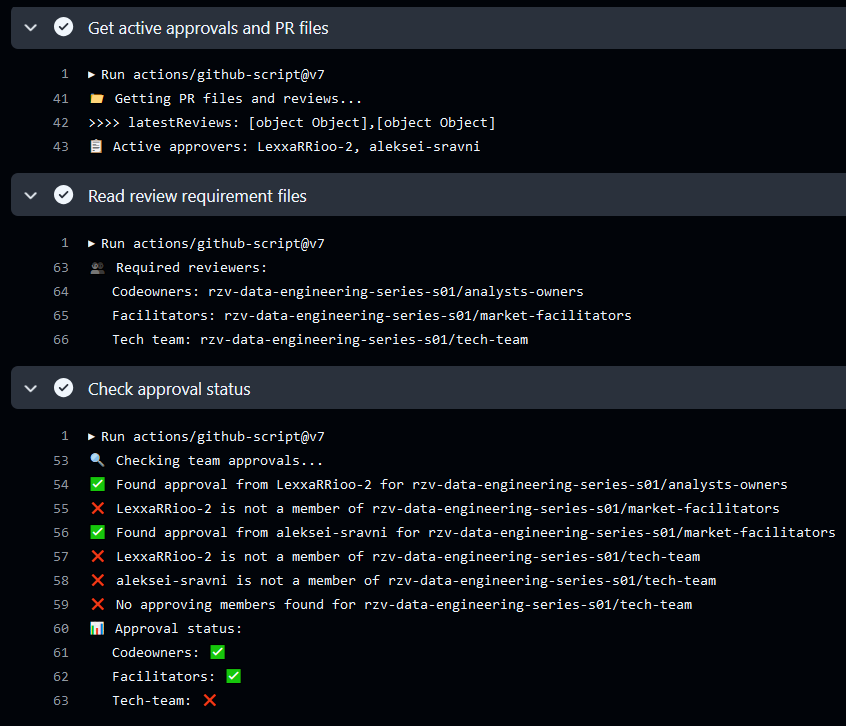